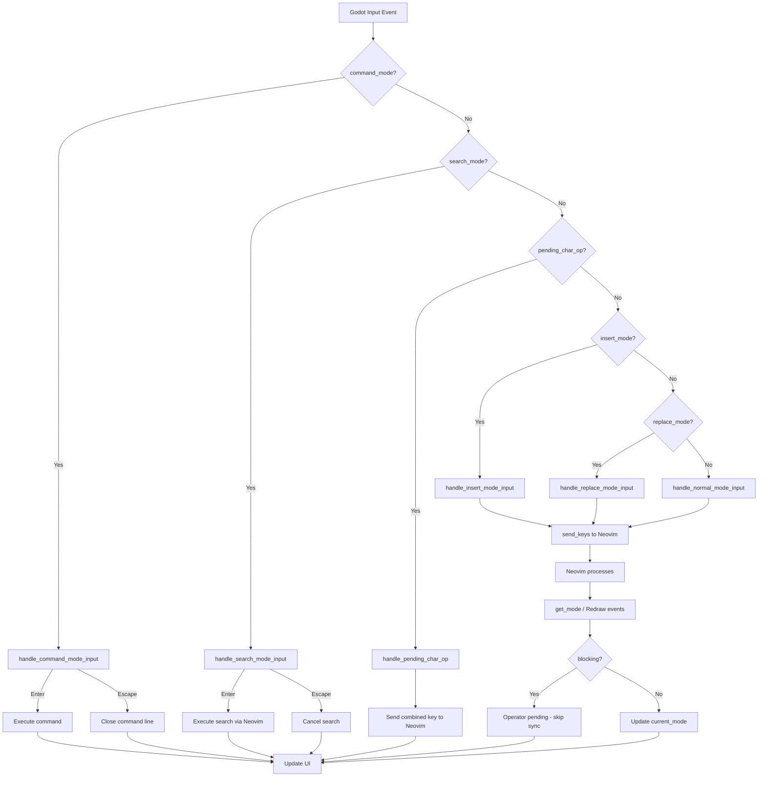
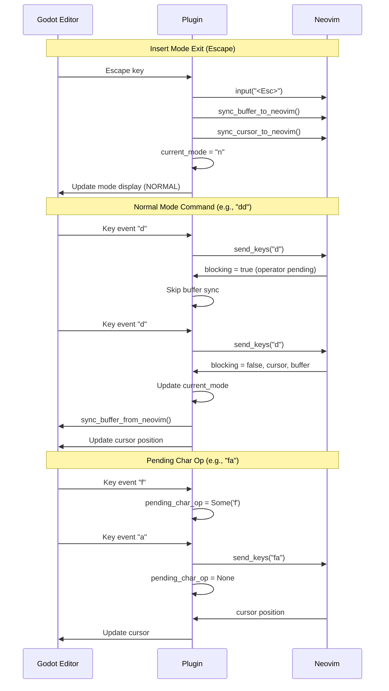
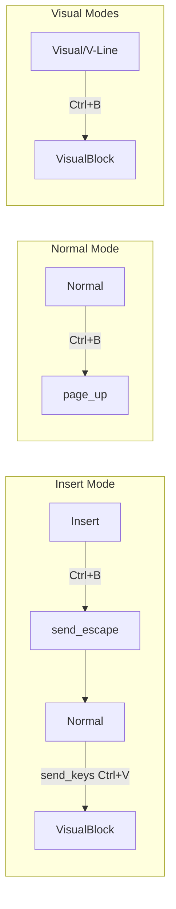

# Godot Neovim State Machine

## Mode Transitions

```mermaid
stateDiagram-v2
    [*] --> Normal: 起動時

    %% Normal mode transitions
    Normal --> Insert: i, a, o, O, A, I, c{motion}, s, C, S
    Normal --> Replace: R
    Normal --> Visual: v
    Normal --> VisualLine: V
    Normal --> VisualBlock: Ctrl+V, Ctrl+B
    Normal --> Command: :
    Normal --> Search: /, ?
    Normal --> OperatorPending: d, c, y, >, <, =, gq, etc.
    Normal --> PendingCharOp: f, F, t, T, r

    %% Operator-pending state
    OperatorPending --> Normal: {motion}, Escape
    OperatorPending --> Insert: c{motion}完了時

    %% Pending char op state
    PendingCharOp --> Normal: {char}, Escape

    %% Insert mode transitions
    Insert --> Normal: Escape, Ctrl+[
    Insert --> Normal: (Ctrl+B step 1)
    Normal --> VisualBlock: (Ctrl+B step 2)
    note right of Insert: Ctrl+B は内部的に\nNormal経由でVisualBlockへ

    %% Replace mode transitions
    Replace --> Normal: Escape, Ctrl+[

    %% Visual mode transitions
    Visual --> Normal: Escape, v, d, y, x, p
    Visual --> VisualLine: V
    Visual --> VisualBlock: Ctrl+V, Ctrl+B
    Visual --> Insert: c, s, C, S

    %% Visual Line mode transitions
    VisualLine --> Normal: Escape, V, d, y, x, p
    VisualLine --> Visual: v
    VisualLine --> VisualBlock: Ctrl+V, Ctrl+B
    VisualLine --> Insert: c, s, C, S

    %% Visual Block mode transitions
    VisualBlock --> Normal: Escape, Ctrl+V, Ctrl+B, d, y, x, p
    VisualBlock --> Visual: v
    VisualBlock --> VisualLine: V
    VisualBlock --> Insert: c, s, C, S, I, A

    %% Command mode transitions
    Command --> Normal: Enter, Escape

    %% Search mode transitions
    Search --> Normal: Enter, Escape
```

## Simplified View (主要な遷移のみ)

```mermaid
stateDiagram-v2
    [*] --> Normal

    Normal --> Insert: i, a, o, c, s
    Normal --> Replace: R
    Normal --> Visual: v, V, Ctrl+V
    Normal --> Command: :
    Normal --> Search: /, ?

    Insert --> Normal: Esc
    Replace --> Normal: Esc
    Visual --> Normal: Esc, 操作完了
    Visual --> Insert: c, s
    Command --> Normal: Enter, Esc
    Search --> Normal: Enter, Esc
```

## Mode Details

| Mode | Display | Color | Cursor | 内部状態 |
|------|---------|-------|--------|----------|
| Normal | NORMAL | Green | Block | `current_mode = "n"` |
| Insert | INSERT | Blue | Line | `current_mode = "i"` |
| Replace | REPLACE | Red | Line | `current_mode = "R"` |
| Visual | VISUAL | Orange | Block | `current_mode = "v"` |
| VisualLine | V-LINE | Orange | Block | `current_mode = "V"` |
| VisualBlock | V-BLOCK | Orange | Block | `current_mode = "\x16"` |
| Command | : | Yellow | - | `command_mode = true` |
| Search | / or ? | Yellow | - | `search_mode = true` |
| OperatorPending | (表示なし) | - | - | `blocking = true` |
| PendingCharOp | (表示なし) | - | - | `pending_char_op = Some(...)` |

## Input Flow



## Buffer Sync Flow



## Ctrl+B Special Behavior



Note: `Ctrl+B` は Godot が `Ctrl+V` をインターセプトするため、VisualBlock への代替キーとして実装されている。
